  

  &nbsp;&nbsp;
  &nbsp;&nbsp;
  

 

### About

I'm a **Web Developer** based in Indonesia who builds modern, high-performance web applications. I focus on creating clean architecture and intuitive user experiences with attention to every detail.

  

 

 

### Tech Stack

  
  
  
  
  

  
  
  
  

  
  
  
  

 

 

### GitHub Stats

  
  &nbsp;&nbsp;
  

  

 

  Open to collaborations — let's build something great together.

