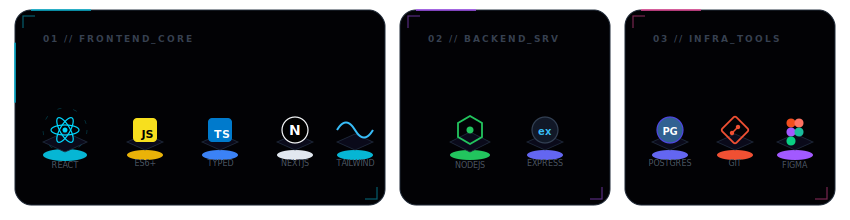

<!-- Heading Section -->

  

  
  
  

---

### 🌌 Profile Overview

Hello! I'm **Kusmayuda**, a passionate **Web Developer** based in Indonesia. I specialize in building responsive, modern, and high-performance web applications. I love combining technical skills with clean design to solve real-world problems and deliver exceptional user experiences.

 

  

---

### 🛠️ Tech Stack & Toolkit

Rather than basic bullet lists, here is my active technology stack configuration dashboard:

  

---

### 📊 GitHub System Analytics

My live system contributions and statistics pulled directly from GitHub:

  
  

  

---

  Let's build something awesome together! Connect with me via email or LinkedIn. ✨

